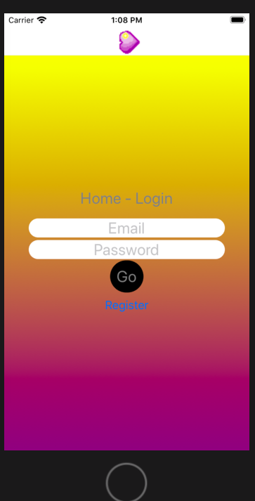
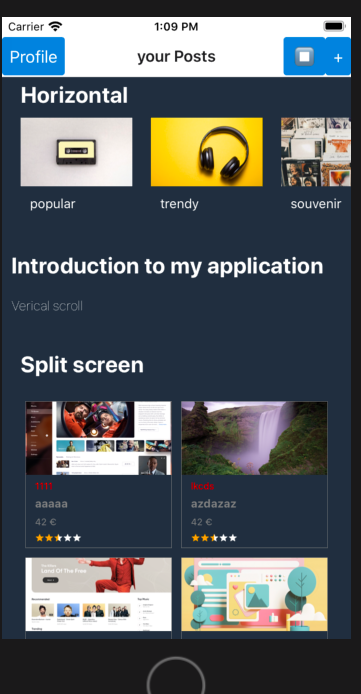
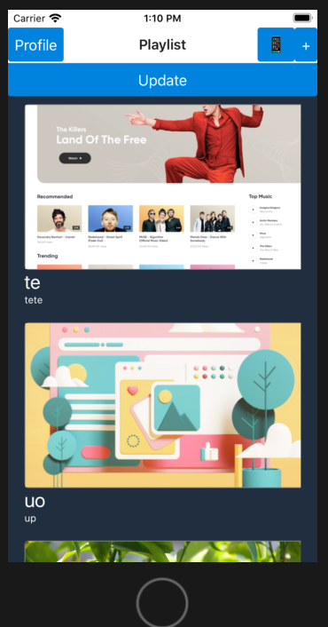
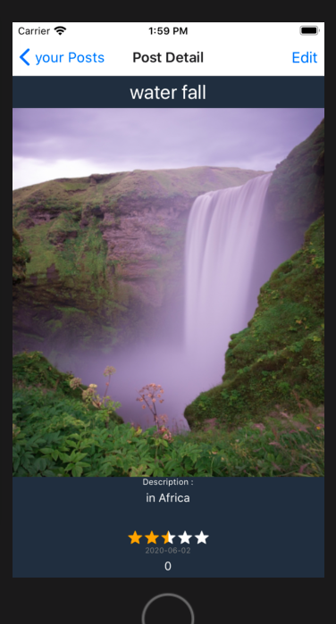
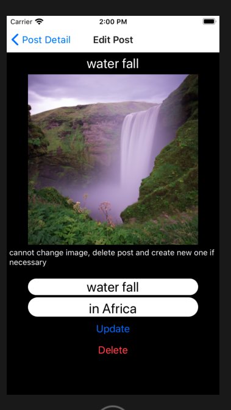
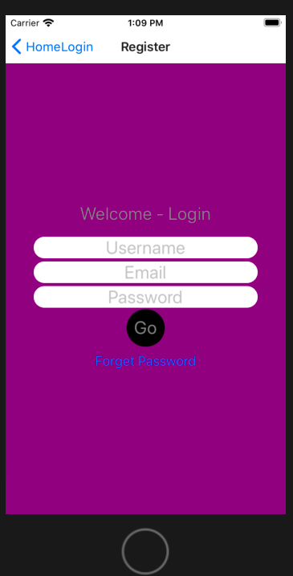
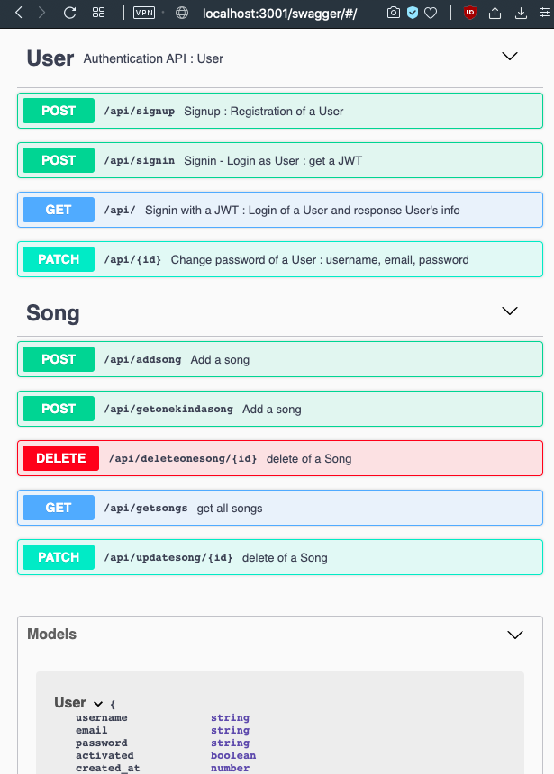

# [React Native - Typescript](https://reactnative.dev/) &middot; [](https://github.com/facebook/react/blob/master/LICENSE) [](https://www.npmjs.com/package/react) 


Technos : mobile 
- react native
- yarn/npm
- expo-cli
- typescript
- jwt token
- cloud database
- mongo db

backend (to link)
- node js
- typescript
- express
- mongo db

# Demo :
## 1.1. Login


## 1.2. Home page : gallery of posts (image, title, description, ranking, date, etc...)

- horizontal scroll
- vertical list
- refresh scrolling down




## 2.1. Details and modify a post

- navigation with header bar




- upload image, and save them


## 3. Register user



## backend connection
a back end is necessary
here is a schema example , also in my other git project :

- replace Song by Post




# Get Start

```
Environment.tsx
App.tsx
src 
├── components
│   ├── DetailList.tsx
│   ├── GetProfile.tsx
│   ├── ListPosts.tsx
│   ├── ListSongs.tsx
│   ├── categories
│   │   ├── Categories.tsx
│   │   └── SplitTiles.tsx
│   ├── forms
│   │   ├── CheckToken.tsx
│   │   ├── EditSong.tsx
│   │   ├── NewPost.tsx
│   │   └── NewSong.tsx
│   ├── post
│   │   ├── DetailPost.tsx
│   │   ├── EditPost.tsx
│   │   ├── ImagePost.tsx
│   │   └── Post.tsx
│   └── song
│       ├── ImageSong.tsx
│       └── Song.tsx
└── screens
    ├── HomeLogin.tsx
    ├── HomeProfile.tsx
    └── HomeRegister.tsx

```

# GET START

make sure your have :
- node js
- yarn/npm
- expo-cli

mobile : 
```
yarn install
expo start
```

select mobile device to displau

backend :
```
git clone [yourbackendproject]
cd  yourbackendproject/backend

nom run dev
```


# INITIALISATION : react native typescript

[video link installation help](https://www.youtube.com/watch?v=oc3PoxqpJkU)


```
npm install expo-cli --global
expo init mobile
# choose minimal typescript
cd mobile
yarn web
# OR
expo start
```

- cd mobile
- yarn android
- yarn ios
- yarn web
- expo start


[video initalisation typescript react native](https://medium.com/javascript-in-plain-english/how-to-build-a-todo-list-app-with-react-hooks-and-typescript-b9cbdc61e966)

## React navigation : header bar
- [Documentation](https://reactnavigation.org/docs/hello-react-navigation)

- [header navigation video link help](https://www.youtube.com/watch?v=OmQCU-3KPms)


## 1. environment variables 

[doc .env](https://www.reactnativeschool.com/easily-manage-different-environment-configurations-in-react-native)
there is problems with .env and typescript in react native 

## 1.1. My solution : creation Environment.tsx
```
import { Platform } from 'react-native';
var _Environments: any = {
  production: { BASE_URL: '', API_KEY: '' },
  development: { BASE_URL: 'abc.xyz', API_KEY: 'LOL', CLOUD_DB: 'abc.xyz', CLOUD_KEY: 'LOL' },
}

// have to choose later Platform.OS === "android" ? "android" : "ios";
function getEnvironment() {
  // Insert logic here to get the current platform (e.g. staging, production, etc)
  var platform: string = "development";
  // ...now return the correct environment
  return _Environments[platform]
}

const Environment = getEnvironment()

export default Environment;
```

than import in your *.tsx
```
import Environment from '../../Environment';
...
        const response: Response = await fetch(`${Environment.BASE_URL}signin`, {
```

```
yarn add @react-navigation/stack
yarn add @react-navigation/native
expo install react-native-gesture-handler react-native-reanimated react-native-screens react-native-safe-area-context @react-native-community/masked-view
```

extra CSS
```
expo install expo-linear-gradient

```
